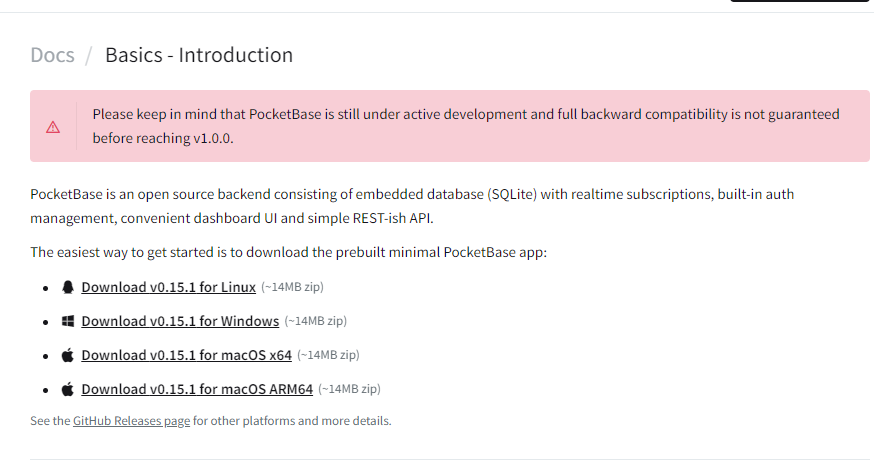
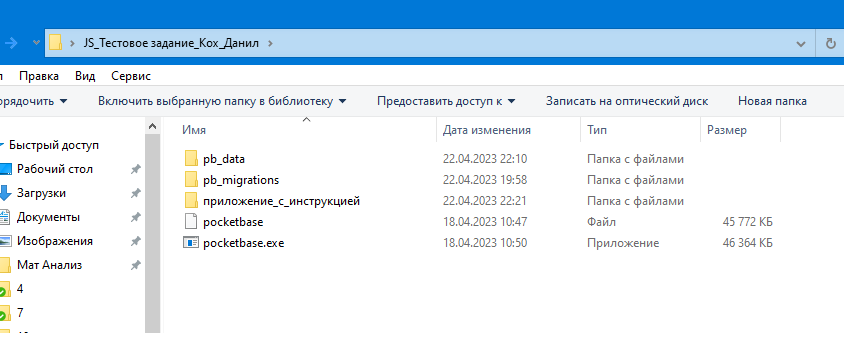

# SafeBoard 2023. Разработка JavaScript

## Запуск бекенда
Для того чтобы запустить сервер для этого приложение, необходимо:
- Перейти по ссылке https://pocketbase.io/docs/ и скачайте необходимый файл в зависимости от вашей ОС. Файлы весят достаточно много (> 5мб), поэтому не было возможности разместить их в текущем архиве.



- Расположить файл дерикторией выше, чтобы в одной дериктории были папки "pb_data" и "pb_migrations"



- На ОС Linux необходимо запустить файл в вышеуказанной дериктории командой 

```bash
 ./pocketbase serve
```

На ос Windows

```bash
 start ./pocketbase serve
```

Можно посмотреть базу данных в Admin UI по ссылке:

http://127.0.0.1:8090/_/

### Параметры для входа: 

    Почта: danil0420022@gmail.com

    Пароль: 1234554321

## Запуск фротенда

### Версия NodeJs 
v16.16.0

### Установка пакетов :

```bash
 npm install
```


### Запуск приложения:

```bash
 npm run dev
```

### Чтобы посмотреть сайт, перейдите по следующей ссылке :

    http://localhost:5173/
  